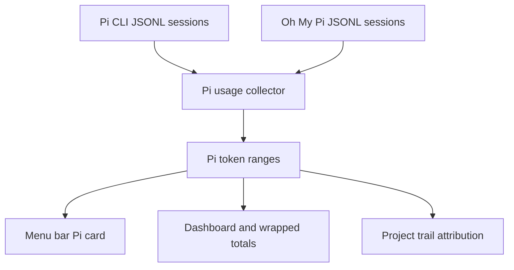
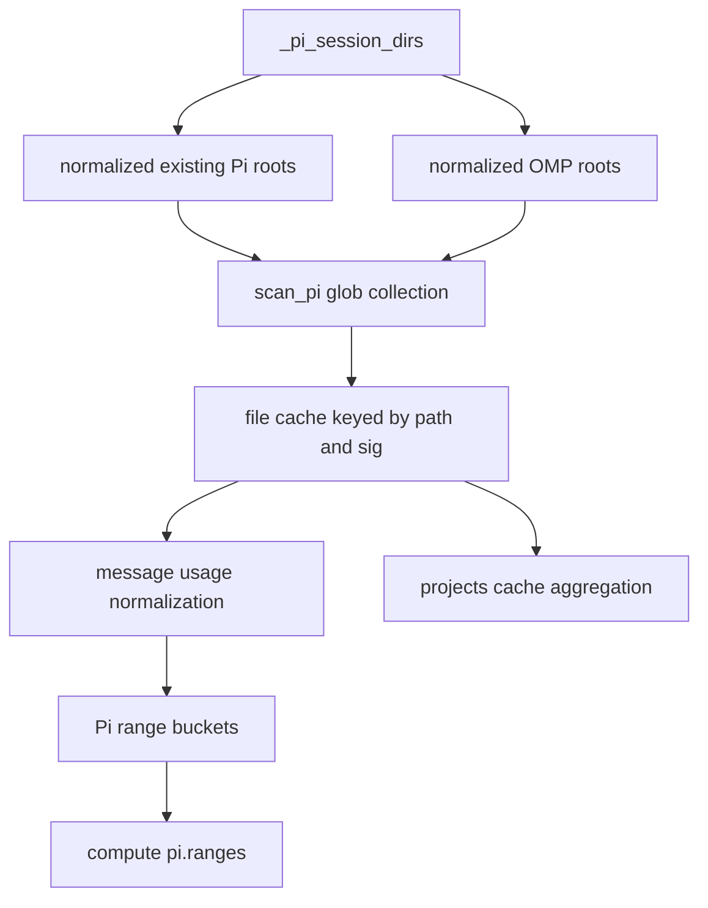

# Pi OMP Session Coverage - Plan

## Goal Capsule

- **Objective:** Pi usage totals include both legacy Pi CLI sessions and Oh My Pi harness sessions without changing the existing Pi card or downstream reporting shape.
- **Product authority:** The Product Contract below is authoritative for scope. Planning preserves the grilling decisions: merge OMP into Pi, scan all OMP sessions by default, count `reasoningTokens` as reasoning, keep UI source-agnostic, and verify both global statistics and project trail attribution.
- **Execution profile:** Implement as a collector-focused fix with stdlib Python regression coverage; Swift app schema changes are out of scope unless implementation disproves the current compatibility assumption.
- **Stop conditions:** Stop and ask before adding a separate Oh My Pi top-level model, changing Swift UI/schema, or dropping project-trail support.
- **Tail ownership:** The implementer owns collector changes, focused tests, docs updates, and the verification gates in this artifact.

---

## Product Contract

### Summary

Tokei should treat Oh My Pi session logs as a second Pi session backend.
The existing Pi totals, model breakdowns, cost estimates, session counts, and project trail entries should include both `~/.pi/agent/sessions` and `~/.omp/agent/sessions` while preserving the current Pi UI surface.

### Problem Frame

Tokei already exposes Pi usage, but the collector only discovers the legacy Pi CLI session root.
Current Oh My Pi sessions are written under the OMP session root with the same session/message shape and compatible usage data, so excluding that root makes the Pi card and project usage trail under-report current harness work.

The observed OMP session shape contains assistant `message.usage` entries with input, output, cache-read, reasoning, and cost data, but the existing Pi scanner only lists `~/.pi/agent/sessions` as its default root.

### Key Decisions

- **Merge OMP into Pi instead of creating a new tool.** The two harnesses share the same JSONL session/message model, and a separate Oh My Pi card would force new app schema and UI work without improving the primary question: total Pi-family usage.
- **Scan all OMP sessions by default.** Tokei is a local global usage tracker, so OMP support must work from the menu bar app without relying on the current process' `PI_SESSION_FILE` environment variable.
- **Count `reasoningTokens` as Pi reasoning.** OMP emits reasoning usage under that field, and leaving it unmapped would continue to undercount total token usage even after the path gap is fixed.
- **Keep the UI source-agnostic.** The Pi card remains a combined Pi-family view; source disclosure belongs in documentation unless future user needs justify a separate breakdown.

### Requirements

**Session discovery**

- R1. The Pi collector must include legacy Pi CLI session logs from `~/.pi/agent/sessions` and Oh My Pi session logs from `~/.omp/agent/sessions` in the same Pi usage result.
- R2. The OMP session root must be discovered by default so normal app execution counts OMP usage without requiring harness-specific environment variables.
- R3. Missing or absent Pi/OMP roots must be treated as empty sources, not collector failures.

**Usage normalization**

- R4. Assistant message usage from both harnesses must map into the existing Pi token fields: input, output, cache read, cache write, reasoning, cost, sessions, and models.
- R5. OMP `reasoningTokens` must contribute to the existing Pi reasoning field and total token calculations.
- R6. When usage contains a concrete total cost, that value must remain authoritative over local price estimation.

**Reporting behavior**

- R7. The existing Pi card, dashboard totals, wrapped totals, and sync merge shape must keep using the current Pi data model rather than a new Oh My Pi data model.
- R8. Project trail aggregation must attribute OMP sessions to their recorded `cwd` under the existing `pi` tool label.
- R9. Documentation must describe Pi support as covering both Pi CLI and Oh My Pi session roots, including the reasoning-token field mapping.

**Correctness and safety**

- R10. Expanding the scanned roots must preserve the existing incremental scan behavior so unchanged session files are not reparsed on every refresh.
- R11. Session counting must avoid accidental double counting when the same file is reached through duplicate configured roots.
- R12. Cache versioning must force reparsing when Pi usage field mapping changes, including newly recognized reasoning fields.

### Acceptance Examples

- AE1. **Covers R1, R2, R4, R5.** Given an OMP JSONL session under the default OMP root with one assistant usage entry containing `input`, `output`, `cacheRead`, `reasoningTokens`, and `cost.total`, when Tokei computes Pi usage, then the Pi range includes those tokens, reasoning, cost, model, and session count.
- AE2. **Covers R1, R3.** Given only legacy Pi CLI session logs and no OMP directory, when Tokei computes Pi usage, then existing Pi totals are unchanged and no OMP missing-root error is reported.
- AE3. **Covers R6.** Given an OMP assistant usage entry with `cost.total`, when cost is calculated, then the reported Pi model/range cost uses the provided total rather than a local estimated replacement.
- AE4. **Covers R8.** Given an OMP session with `cwd` set to a project path, when project trail data is generated, then that project includes the OMP tokens and lists `pi` in its tools.
- AE5. **Covers R10, R11, R12.** Given repeated scans over unchanged Pi and OMP logs, when the scanner refreshes, then it reuses unchanged file cache entries, does not count a duplicate root twice, and reparses files when the Pi usage mapping changes.

### Success Criteria

- A representative OMP session fixture or observed local OMP session contributes non-zero Pi tokens when the collector is run against the OMP root.
- Existing Pi CLI session samples continue to produce the same input, output, cache, cost, session, and model totals after OMP support is added.
- Project trail output includes OMP-backed work under the correct project path without adding a new tool label.
- The Swift app model does not require new top-level usage fields for this change.

### Scope Boundaries

- No new Oh My Pi card, top-level JSON key, Swift usage stat, dashboard field, or sync merge type.
- No source breakdown in the Pi UI for this version.
- No migration of historical cache files beyond normal cache invalidation if the collector version changes.
- No pricing update, network behavior, or external API lookup changes.
- No changes to unrelated tool collectors.

### Dependencies / Assumptions

- OMP session JSONL remains compatible with the observed `type=session` plus assistant `message.usage` structure.
- OMP session records continue to carry `cwd` for project attribution.
- Existing incremental cache invalidation can be versioned when scanner semantics change.

### Sources / Research

- `usage.30s.py:31-32` defines the current Pi agent/session environment roots and defaults.
- `usage.30s.py:1367-1480` contains the existing Pi scanner, usage mapping, session `cwd` capture, and cache entry shape.
- `usage.30s.py:1643-1817` shows Pi data flowing into the existing `pi.ranges` output via the shared token usage schema.
- `usage.30s.py:2658-2752` shows project trail aggregation reading `cache["pi"]` entries and labeling them as `pi`.
- `Tokei/Sources/Tokei/Model.swift:454-547` shows Pi decoding through `TokenUsageStat`, so merged OMP data can preserve the current Swift schema.
- `Tokei/Sources/Tokei/PanelView.swift:208-234` shows the existing Pi card consuming the shared Pi range.
- `Tokei/Sources/Tokei/SyncManager.swift:124-126` shows Pi sync merge already follows the shared token range merge path.

---

## Planning Contract

### Product Contract Preservation

Product Contract preserved; R12 makes cache-version invalidation explicit so the implementation cannot satisfy path discovery while leaving old parsing semantics cached.
No product scope was added beyond the frozen grilling decisions.

### Key Technical Decisions

- KTD1. **Extend the existing Pi scanner instead of adding an OMP scanner.** This keeps the output under `pi.ranges`, preserves Swift decoding through `TokenUsageStat`, and avoids extra sync merge logic.
- KTD2. **Treat OMP as an additional session root.** Default root discovery should cover `~/.omp/agent/sessions` alongside the existing Pi roots, with duplicate root paths normalized before scanning.
- KTD3. **Keep usage normalization in the Pi scanner.** `reasoningTokens` joins the existing reasoning fallback chain, and `usage.cost.total` remains the preferred cost source.
- KTD4. **Version the scan cache when parsing semantics change.** Root expansion discovers new files naturally, but field-mapping changes require cache invalidation so stale per-file summaries cannot hide newly counted reasoning fields.
- KTD5. **Test through collector behavior, not Swift UI.** The required behavior lands in `usage.30s.py`; Swift views already consume the shared Pi range and should remain untouched unless tests prove the output schema changes.

### High-Level Technical Design

The implementation should keep the collector's current day-bucket and model aggregation flow.
The only intended behavior changes are broader source discovery, richer reasoning-field mapping, duplicate-root protection, and cache invalidation for changed parsing semantics.

### Sequencing

Implement collector behavior first, then tests, then docs.
Do not touch Swift app files unless the collector output no longer decodes into the current `TokenUsageStat` shape.

### Risks & Dependencies

| Risk | Mitigation |
|---|---|
| OMP session schema drifts after the observed sample | Keep parsing tolerant of missing fields and add fixture coverage for the observed shape rather than assuming every optional field exists. |
| Full OMP history makes refresh slower | Preserve mtime/size cache behavior and avoid reparsing unchanged files. |
| Cache hides newly counted reasoning tokens | Bump the scan cache version with the parser change. |
| Duplicate configured roots double-count files | Normalize root paths and test duplicate-root behavior. |

---

## Implementation Units

### U1. Extend Pi session source discovery

- **Goal:** The Pi collector discovers both legacy Pi CLI and OMP session roots by default while preserving empty-root tolerance.
- **Requirements:** R1, R2, R3, R10, R11.
- **Dependencies:** None.
- **Files:** `usage.30s.py`, `tests/test_pi_omp_usage.py`.
- **Approach:** Extend the existing Pi session directory discovery to include the OMP session root, normalize duplicate roots, and keep absent roots as no-op inputs.
- **Patterns to follow:** Existing `_pi_session_dirs()` root normalization and `scan_pi()` recursive JSONL collection in `usage.30s.py:1370-1415`.
- **Test scenarios:**
  - OMP-only temp home: a JSONL file under the OMP root is discovered and counted in Pi ranges.
  - Pi-only temp home: existing Pi root behavior remains unchanged when no OMP root exists.
  - Duplicate configured roots: the same resolved root does not make one session count twice.
  - Missing roots: absent Pi and OMP directories return empty Pi ranges without errors.
- **Verification:** Focused Python tests prove source discovery and duplicate-root behavior without requiring Swift app changes.

### U2. Normalize OMP usage fields and cache invalidation

- **Goal:** OMP assistant usage maps into the current Pi token fields, including reasoning and authoritative cost, with cache semantics updated for the parser change.
- **Requirements:** R4, R5, R6, R10, R12, AE1, AE3, AE5.
- **Dependencies:** U1.
- **Files:** `usage.30s.py`, `tests/test_pi_omp_usage.py`.
- **Approach:** Extend the existing usage extraction fallback chain so `reasoningTokens` contributes to `reason`, keep `usage.cost.total` as the first cost source, and bump the scan cache version.
- **Patterns to follow:** Current `_pi_usage_cost()` cost priority and `scan_pi()` usage field extraction in `usage.30s.py:1388-1464`.
- **Test scenarios:**
  - OMP assistant usage with `reasoningTokens` increments the Pi `reason` value and total token calculation.
  - `usage.cost.total` is used as the range/model cost instead of local price estimation.
  - Existing Pi usage with `reasoning` or no reasoning field still parses correctly.
  - A cache version change invalidates stale summaries so newly recognized fields are reparsed.
- **Verification:** Focused tests compare expected token/cost totals against collector output for OMP and Pi fixtures.

### U3. Preserve project trail attribution

- **Goal:** OMP sessions appear in project trail data under the existing `pi` tool label using session `cwd`.
- **Requirements:** R7, R8, AE4.
- **Dependencies:** U1, U2.
- **Files:** `usage.30s.py`, `tests/test_pi_omp_usage.py`.
- **Approach:** Preserve the existing cache entry `proj` behavior for OMP sessions so `projects()` continues to aggregate through `cache["pi"]` without a new source label.
- **Patterns to follow:** Session `cwd` capture in `scan_pi()` and project aggregation in `usage.30s.py:1438-1467` and `usage.30s.py:2686-2705`.
- **Test scenarios:**
  - OMP session line with `cwd` populates the Pi cache entry project path.
  - Project trail output includes the OMP token total under that project.
  - Project trail `tools` remains `pi`, not `omp` or `oh-my-pi`.
- **Verification:** Tests exercise `projects()` or its underlying aggregation path against a temp cache and confirm project-level token/cost attribution.

### U4. Update documentation for merged Pi coverage

- **Goal:** User-facing docs explain that Pi usage includes both Pi CLI and Oh My Pi session roots and document the reasoning field mapping.
- **Requirements:** R9.
- **Dependencies:** U1, U2.
- **Files:** `README.md`, `CALCULATION.md`.
- **Approach:** Update the supported-source and token-mapping docs without changing the app UI name or promising source breakdown.
- **Patterns to follow:** Existing data-source table in `CALCULATION.md:7-19` and Pi token mapping in `CALCULATION.md:70-76`.
- **Test scenarios:** Test expectation: none -- documentation-only unit; verify by reading the rendered markdown diff for accuracy.
- **Verification:** Documentation names both roots and states that `reasoningTokens` maps to the Pi reasoning metric.

---

## Verification Contract

| Gate | Command | Applies when | Done signal |
|---|---|---|---|
| Python syntax | `python3 -m py_compile usage.30s.py` | Any collector change | Command exits 0. |
| Focused regression tests | `python3 -m unittest tests.test_pi_omp_usage` | After adding the fixture tests | OMP discovery, reasoning, cost, cache, and project attribution tests pass. |
| JSON smoke | `python3 usage.30s.py --json` | After collector changes | Command exits 0 and output decodes as JSON with a `pi.ranges` object. |
| Project trail smoke | `python3 usage.30s.py --projects` | After collector changes | Command exits 0 and output decodes as a JSON list. |
| Swift compile smoke | `swift build --package-path Tokei` | Only if Swift files are modified | Command exits 0. |

Use real local session data only as a smoke check.
The regression tests must use fixtures or temp directories so future runs do not depend on one user's home directory.

---

## Definition of Done

- U1-U4 are complete and every requirement R1-R12 is either implemented or proven already satisfied by existing code.
- Acceptance examples AE1-AE5 are covered by focused tests or documented smoke checks.
- `usage.30s.py` still returns a Pi object compatible with `TokenUsageStat`.
- No new top-level Oh My Pi schema, Swift card, sync merge type, or UI source breakdown is introduced.
- README and calculation docs describe the merged Pi/OMP coverage accurately.
- All applicable Verification Contract gates pass.
- Abandoned experiments, debug prints, temporary fixture files outside the test suite, and one-off local paths are removed before handoff.
